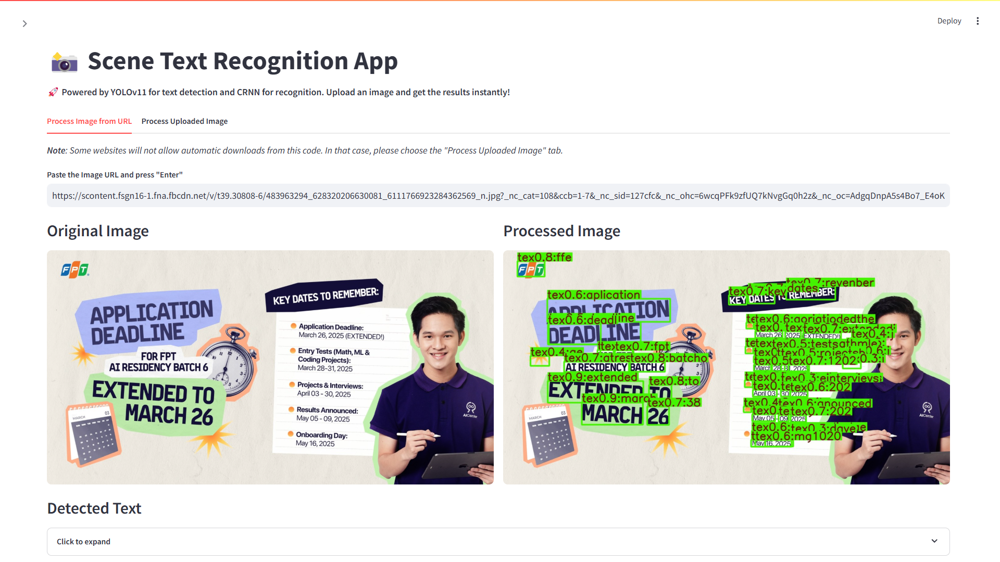

# Scene Text Recognition (STR)


## 📌 Project Overview

This repository contains a complete **Scene Text Recognition (STR)** pipeline that integrates **YOLOv11m** for text detection and **CRNN** for text recognition. The system efficiently detects and recognizes text in natural scene images using deep learning models.

### Pipeline Overview

**1. Text Detection**
- Utilizes **YOLOv11m** to identify text regions in images.
- Returns bounding boxes along with confidence scores.

**2. Text Recognition**
- Employs **CRNN** (Convolutional Recurrent Neural Network) to recognize text from detected regions.
- Uses **CTC Loss** for sequence prediction.

**3. End-to-End OCR System**
- Combines detection and recognition into a fully functional pipeline.
- Outputs structured text predictions.


### Deployment

**1. Web Interface**: Built with **Streamlit** for an interactive user experience.

**2. API Service**: Powered by **FastAPI** and **Ray Serve** for scalable, high-performance OCR processing.

<p align="center">
  
  
</p>


## 🚀 Key Features

- **State-of-the-art models**: Uses **YOLOv11m** for detection and **CRNN with ResNet34 backbone** for recognition.
- **Optimized for real-world datasets**: Trained and fine-tuned on **ICDAR2003** dataset.
- **Scalable deployment**: Web-based interface with **Streamlit**, **FastAPI**, and **Ray Serve**.
- **GPU acceleration**: Fully optimized for Kaggle’s **T4 GPU (16GB)** for efficient training and inference.
- **Modular design**: Easily extendable and integrable into other OCR applications.


## 📂 Project Structure

```bash
Scene-Text-Recognition/
│── .streamlit/                # Streamlit configuration files
│── deployment/
│   ├── app.py                 # Streamlit web application
│   ├── crnn.py                # CRNN model implementation
│   ├── object_detection.py    # FastAPI service for text detection (YOLOv11m)
│   ├── ocr.py                 # FastAPI service for full OCR pipeline
│   ├── Makefile               # Deployment configurations for Ray Serve
│── weights/                   # Pretrained weights (YOLOv11m and CRNN)
│── phase1_detection.ipynb     # Notebook for training text detection
│── phase2_recognition.ipynb   # Notebook for training text recognition
│── phase3_full.ipynb          # Notebook integrating the full pipeline
│── requirements.txt           # Dependencies and libraries
│── LICENSE
│── README.md                  # Project documentation
# P          R      mAP50 (1)
# 0.881      0.905      0.925 (train)
# 0.881      0.905      0.925 (val)
```


## 🛠 Installation & Usage

**Important Notice**:
This project is built using FastAPI and Ray Serve. To access the Streamlit web app, you must **clone this repository and start the server first** before running the Streamlit interface.

⚠️ **Directly accessing the provided URL will not work** because the backend server must be running locally.

**Install dependencies**:
```bash
# Install PyTorch (Optional: GPU Support)
# https://pytorch.org/get-started/previous-versions/
conda install pytorch==2.5.1 torchvision==0.20.1 torchaudio==2.5.1 pytorch-cuda=12.4 -c pytorch -c nvidia

# Install dependencies
pip install -r requirements.txt
```

**Deploy app**:

```bash
# Note: If your device doesn't have `make` command, you can use Git Bash instead

# Initialize the environment
cd deployment
make init

# Start OCR service (Ray + FastAPI)
cd deployment
make deploy_ocr

# Launch Streamlit app for UI-based inference
cd deployment
make streamlit
```


## 📜 License
This project is licensed under the MIT License – feel free to modify and distribute it as needed.

## 🤝 Acknowledgments

This project was assigned by the AIO course from [AI VIET NAM](https://www.facebook.com/aivietnam.edu.vn) and completed by me as a participant of the course.

If you find this project useful, consider ⭐️ starring the repository or contributing to further improvements!
